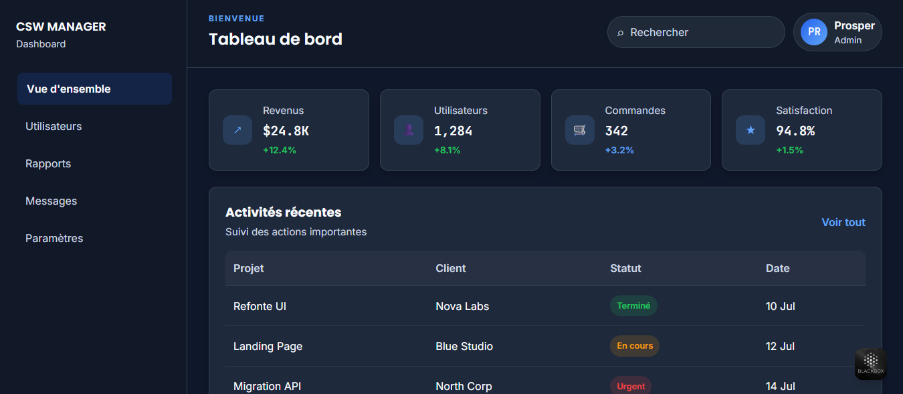
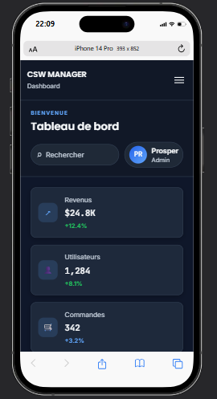

# Dashboard Admin Responsive

Un dashboard admin moderne et responsive développé en HTML5 et CSS3 dans le cadre de la formation chez Akieni Academy.

Ce projet met en pratique la création d'un interface d'administration professionnelle en utilisant Flexbox, CSS Grid, un menu hamburger en CSS pur et un design sombre inspiré des tableaux de bord SaaS modernes.

---

# Aperçu

## Version Desktop



---

## Version Mobile



---

# Présentation

Un dashboard admin doit permettre une lecture rapide des données, une navigation claire et une expérience fluide sur desktop, tablette et mobile.

Dans ce projet, j'ai conçu un tableau de bord administratif moderne, épuré et responsive, avec :

- une sidebar de navigation,
- un header avec recherche et profil,
- des cartes statistiques,
- un tableau de données,
- une zone graphique fictive,
- un menu hamburger en CSS uniquement.

L'objectif était de créer une interface professionnelle, accessible et facilement réutilisable dans de futurs projets.

---

# Objectifs pédagogiques

Ce projet m'a permis de mettre en pratique :

- HTML5 sémantique
- CSS3 moderne
- Flexbox
- CSS Grid
- Responsive Design
- Media Queries
- Variables CSS
- Architecture BEM
- Menu burger en CSS pur
- Accessibilité
- Design système

---

# Fonctionnalités

- Sidebar de navigation moderne
- Header avec recherche et actions utilisateur
- Cartes statistiques élégantes
- Tableau de données stylisé
- Section graphique fictive
- Menu hamburger responsive sans JavaScript
- Design sombre et professionnel
- Structure HTML5 claire et accessible

---

# Technologies utilisées

- HTML5
- CSS3
- Flexbox
- CSS Grid
- Media Queries
- Google Fonts
- Git
- GitHub
- Visual Studio Code

---

# Structure du projet

```text
dashboard-admin/
│
├── index.html
├── README.md
├── css/
│   └── style.css
```

---

# Design System

## Palette de couleurs

| Usage             | Couleur |
| ----------------- | ------- |
| Primary           | #2563EB |
| Primary Hover     | #1D4ED8 |
| Secondary         | #3B82F6 |
| Accent            | #60A5FA |
| Background        | #0F172A |
| Surface           | #111827 |
| Surface Secondary | #1F2937 |
| Card Background   | #1E293B |
| Border            | #334155 |
| Text Primary      | #F8FAFC |
| Text Secondary    | #CBD5E1 |

---

## Typographie

Le projet utilise :

- Poppins pour les titres
- Inter pour le contenu
- JetBrains Mono pour les valeurs numériques

---

# Compétences mises en pratique

- Flexbox
- CSS Grid
- Responsive Design
- Media Queries
- Variables CSS
- BEM
- Positionnement
- Box Model
- Transitions
- Transform
- Menu burger CSS-only (`:checked`)
- Combinateurs CSS

---

# Accessibilité

Le projet applique plusieurs bonnes pratiques d'accessibilité :

- Structure HTML5 sémantique (`header`, `main`, `section`, `footer`)
- Navigation claire et structurée
- Liens et boutons avec états visibles
- Contraste de couleurs adapté
- Focus visible sur les éléments interactifs
- Menu burger associé à un label et à une checkbox

---

# Compétences développées

Grâce à ce projet, j'ai renforcé mes compétences en :

- Développement Front-End
- Conception d'interfaces administratives
- Architecture CSS
- Flexbox et CSS Grid
- Accessibilité Web
- Création de composants réutilisables

---

# Auteur

**Prosper Kwon Gee**

Étudiant en Conception des Systèmes d'Information  
Développeur Fullstack en formation chez **Akieni Academy**

- GitHub : https://github.com/KwonGee-Lukelo
- LinkedIn : https://www.linkedin.com/in/prosper-kwon-gee-59932b29a

---

# Licence

Projet réalisé à des fins pédagogiques dans le cadre de la formation chez **Akieni Academy**.
